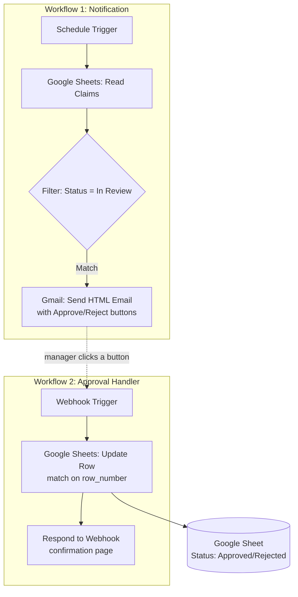

# 💸 Expense Claim Approval Automation (n8n)


A **zero-touch expense claim approval system** built in n8n. Managers approve or reject expense claims with a single click directly from their email — no logins, no forms, no manual follow-ups. Every action updates a Google Sheet instantly, creating a live, auditable approval trail.

This project is part of an ongoing portfolio of **Finance Automation** builds, following on from a [Bank Reconciliation Automation](#) and an [AI-Powered AP Invoice Processing](#) workflow — each demonstrating how traditional finance processes can be re-engineered with automation and light AI.

---

## 🧩 The Problem

Manual expense approvals typically involve:
- Finance manually emailing managers about pending claims
- Managers replying "approved" / "rejected" over email or chat
- Finance manually finding the row and updating status in a tracker

This is slow, easy to lose track of, and creates no reliable audit trail.

## ✅ The Solution

Two decoupled n8n workflows work together to fully automate the approval lifecycle:

### Workflow 1 — Claim Notification
```
Schedule Trigger → Google Sheets (Read) → Filter (Status = "In Review") → Gmail (HTML email with Approve/Reject buttons)
```

### Workflow 2 — Approval Handler
```
Webhook (button click) → Google Sheets (Update Row) → Respond to Webhook (confirmation page)
```

## 🏗️ Architecture



## ⚙️ Key Technical Details

| Challenge | Solution |
|---|---|
| Managers need one-click approval, not a form | HTML action buttons embedded directly in the Gmail node, styled inline |
| Button click needs to trigger a backend action | A separate always-on **Webhook** workflow, decoupled from the scheduled notification workflow |
| Passing claim context through a simple link click | Query parameters (`row_number`, `action`) appended to each button's URL |
| Mapping the click back to the right sheet row | `{{ $json.query.row_number }}` used as the match column in Google Sheets |
| Avoiding accidental data loss on update | Only the `Status` field is mapped in "Fields to Update" — all other fields excluded to prevent overwriting |
| Giving the manager confidence the click worked | `Respond to Webhook` returns a styled HTML confirmation page |

## 📧 Sample Email

The notification email includes claim details and two styled call-to-action buttons:

```html
<p>Hi Manager,</p>
<p>A new expense claim is pending for your review and approval:</p>
<ul>
  <li><strong>Claim ID:</strong> {{ $json.Claim_ID }}</li>
  <li><strong>Row Number:</strong> {{ $json.row_number }}</li>
</ul>
<p>Please click an option below:</p>
<a href="...?row_number={{ $json.row_number }}&action=Approved">✅ Approve</a>
<a href="...?row_number={{ $json.row_number }}&action=Rejected">❌ Reject</a>
```

## 🔁 Flow Statuses

| Status | Meaning |
|---|---|
| `In Review` | Claim awaiting manager decision |
| `Approved` | Manager clicked Approve — sheet updated instantly |
| `Rejected` | Manager clicked Reject — sheet updated instantly |

## 🛠️ Tech Stack

- **n8n** — workflow orchestration (2 linked workflows: scheduled notifier + always-on webhook listener)
- **Google Sheets** — claims data store and single source of truth
- **Gmail** — HTML email notifications with embedded action buttons
- **Webhook / Respond to Webhook** — stateless, one-click approval capture

## 🚀 Setup

1. **Notification workflow**: Schedule Trigger → Google Sheets (Read) → Filter (`Status` = `In Review`) → Gmail (HTML, with Approve/Reject links pointing to your webhook URL)
2. **Approval workflow**: Webhook (GET, path e.g. `approve-claim`, Respond via "Respond to Webhook" node) → Google Sheets (Update Row, match on `row_number`, update `Status` only) → Respond to Webhook (HTML confirmation)
3. Replace the placeholder webhook URL in the Gmail node's HTML with your **Production URL**
4. Activate **both** workflows — the notifier runs on schedule, the webhook listens 24/7

## 📌 Roadmap Ideas

- Add manager authentication token to the webhook URL for extra security
- Slack notification as an alternative/parallel channel
- Multi-level approval (manager → finance) chaining
- Automatic reminder email if a claim stays "In Review" too long

---

### 🔗 Related Projects
- Bank Reconciliation Automation (n8n)
- AI-Powered AP Invoice Processing (n8n + PDF.co + Gemini)

*Built as part of a Finance Automation portfolio, combining 10+ years of Finance & Accounts experience with modern automation tooling.*
